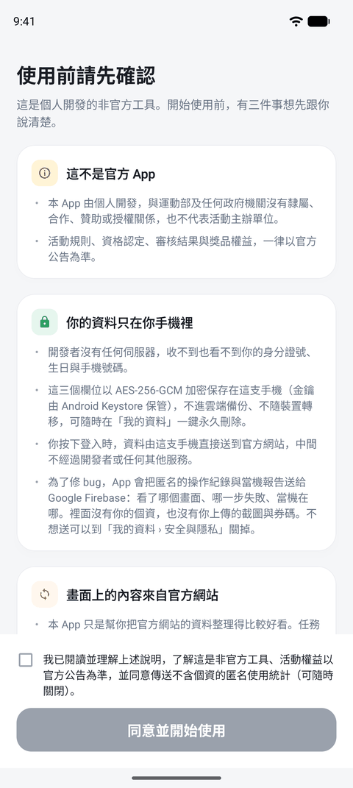
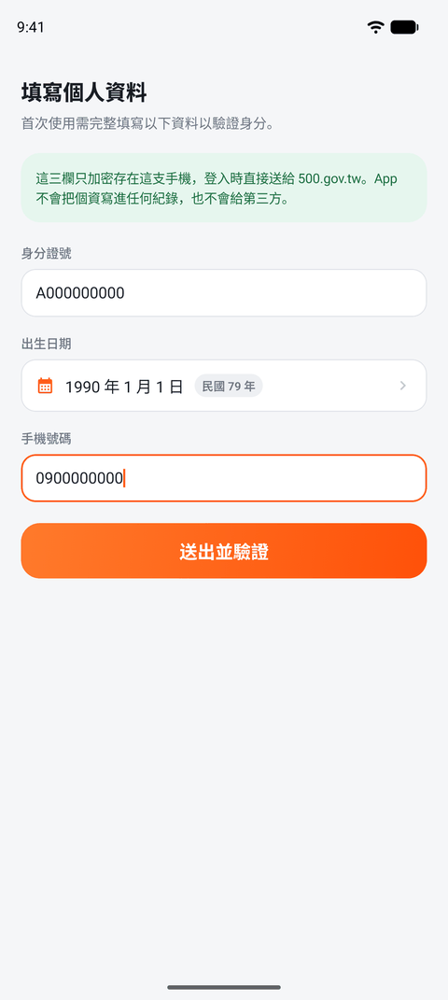
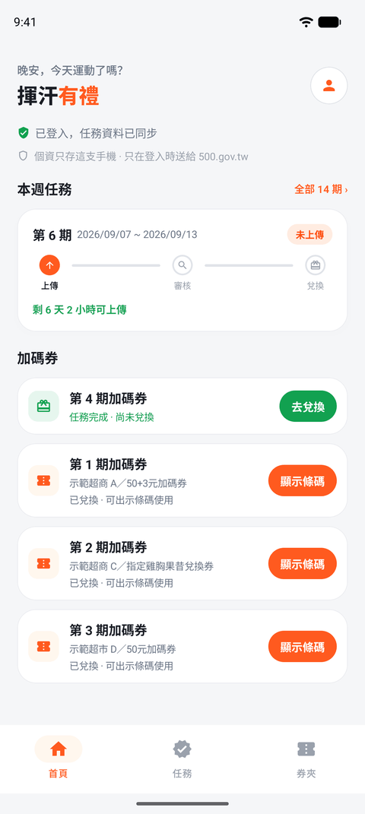
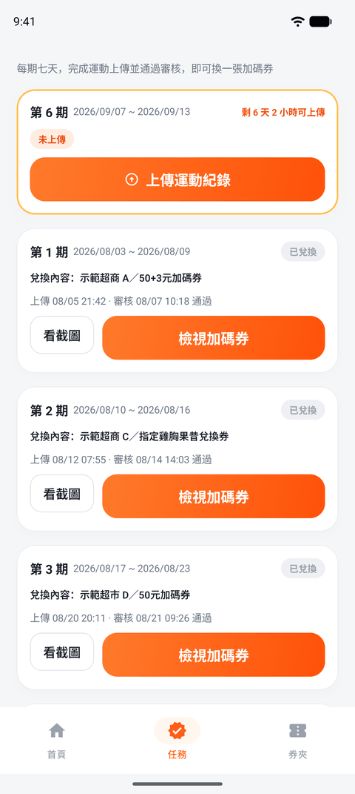
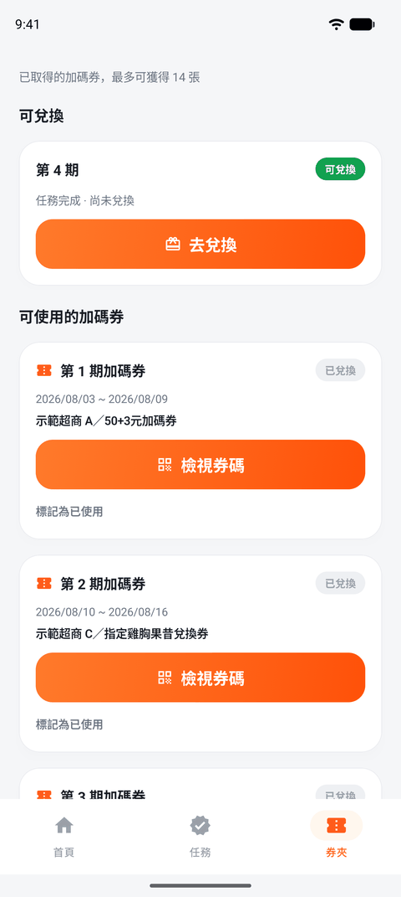
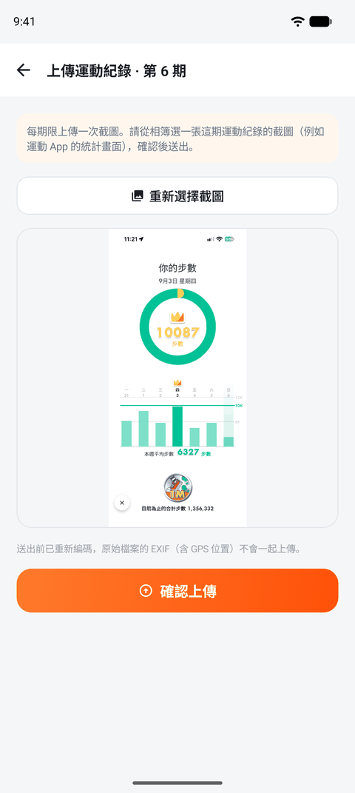
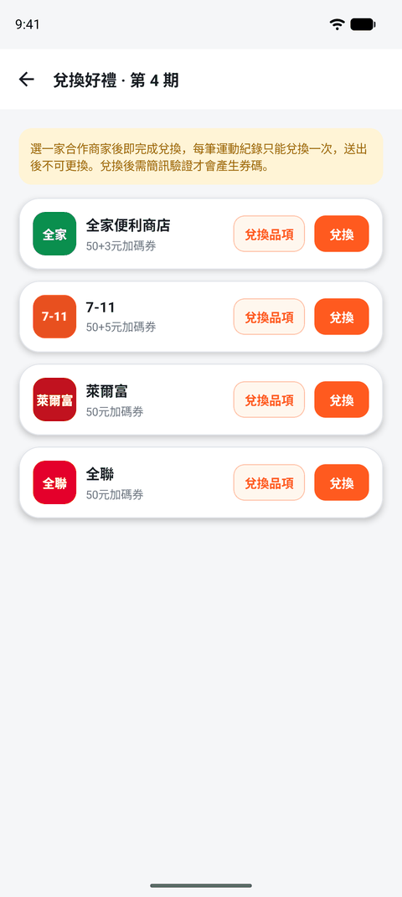
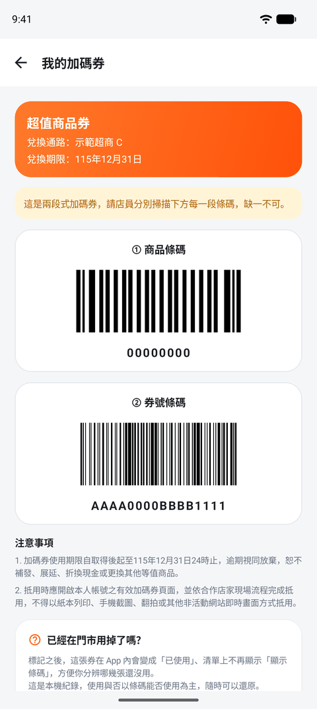
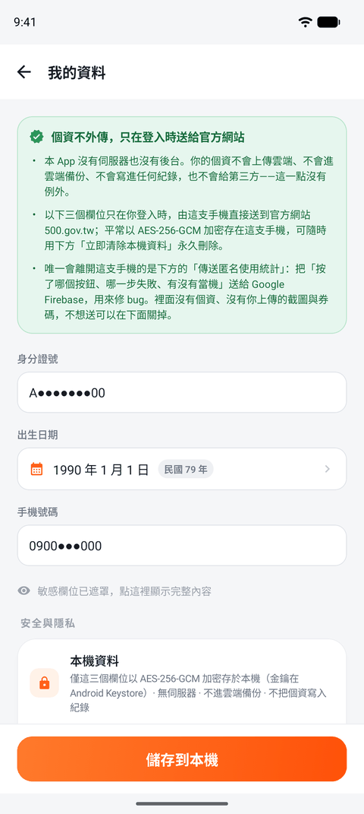

# Exercise Rewards（Android）

協助參加台灣運動部「揮汗有禮・全民動起來」運動幣加碼活動的 Android App：
一鍵登入官方「我的任務」、免重複輸入個資、在同一頁看完本週任務與手上的加碼券。

> **這是非官方工具，與運動部及任何政府機關沒有隸屬、合作、贊助或授權關係。**
> 活動規則與最終權益一律以官方公告為準。

這是 [iOS 版](https://github.com/megshao/sports_rewards_ios) 的 Android 對應實作。
兩邊是同一份領域邏輯的兩次實作，**型別名稱刻意保持一致**（`HTTPClienting`、`AuthServicing`、
`TaskParser`…），這樣跨 repo 可以直接 grep 對照。

| | |
|---|---|
| 平台 | Android 8.0（API 26）以上，僅直向、介面固定繁體中文 |
| 建置 | AGP 9.4 / Gradle 9.7 / Kotlin 2.2.10 / **JDK 21** / compileSdk 37 |
| 第三方相依 | OkHttp、kotlinx-serialization、Firebase（Analytics + Crashlytics）。**加密不依賴第三方函式庫**，只用平台 Keystore |
| 授權 | MIT（[`LICENSE`](LICENSE)） |
| 隱私權政策 | <https://megshao.github.io/exercise_rewards_android/privacy.html> |
| 刪除帳戶與資料 | <https://megshao.github.io/exercise_rewards_android/delete-account.html> |
| 支援與 FAQ | <https://megshao.github.io/exercise_rewards_android/support.html> |

---

## 畫面

全部在**示範模式**下拍攝，所以下面每一張都**沒有任何真實個資**（示範帳號是刻意設計的哨兵值
`A000000000`，檢查碼不合法，真實使用者不可能誤觸）。原始圖在
[`docs/screenshots/raw/`](docs/screenshots/raw)，由
[`scripts/capture-screenshots.sh`](scripts/capture-screenshots.sh) 走完整流程自動產生；
這裡的縮圖由 [`docs/screenshots/readme/make-thumbs.py`](docs/screenshots/readme/make-thumbs.py) 產生。

### 首次啟動：把揭露擋在功能前面

| 免責聲明 | 個資填寫 |
|---|---|
|  |  |

**免責聲明**擋在所有功能之前，三個區塊分別講「這不是官方 App」「你的資料只在你手機裡」
「畫面上的內容來自官方網站」。按下「同意並開始使用」**是整支 App 第一次執行 Firebase 程式碼的時機**
——在那之前一行都沒跑。這件事在 Android 上需要額外的功夫：`firebase-common` 會自己塞一個
`FirebaseInitProvider`，而 `ContentProvider.onCreate` 早於 `Application.onCreate`，
所以 manifest 用 `tools:node="remove"` 把它整個移掉（詳見[架構](#架構)）。

**個資填寫**只收三欄，畫面上那段綠色說明就是承諾本身：這三欄以 AES-256-GCM 加密只存在這支手機。
出生日期走自製滾輪並**同時顯示西元與民國**——那裡踩過一個坑（中央高亮與實際選取值不一致），
現在由 `visibleItemsInfo` 算出真正靠近視窗中心的那一項，不再用 `firstVisibleItemIndex` 猜。

### 主畫面的三個分頁

| 首頁 | 任務 | 券夾 |
|---|---|---|
|  |  |  |

**首頁**把「這週要做什麼」和「手上有什麼券」放在同一頁——本週任務置頂，下面是加碼券清單，
不需要在分頁之間來回找。

**任務**列出 14 期。當期用琥珀色雙邊線高亮，卡片上是「上傳 → 審核 → 兌換」的進度時間軸與剩餘可上傳時間；
已兌換的期別在下方。「本週是哪一期」「這一期還能不能上傳」是**規則不是排版**，所以寫在
`:core` 而不是 Composable 裡——寫在 `if` 裡的規則沒有任何測試搆得到，搬進 `core` 之後才有 268 條測試守著。

**券夾**把券分成「可兌換」（任務完成但還沒選通路）與「可使用」（已兌換、可出示條碼）兩區。
「標記為已使用」是**純本機紀錄**，只是幫你分辨哪幾張還沒用——實際能不能用以門市掃碼為準。

### 任務流程：上傳 → 兌換 → 出示條碼

| 上傳運動紀錄 | 兌換 | 券碼 |
|---|---|---|
|  |  |  |

**上傳**從相簿挑一張運動紀錄截圖。選好圖之後畫面上會多一行字：
「送出前已重新編碼，原始檔案的 EXIF（含 GPS 位置）不會一起上傳。」那不是宣傳語——相簿原檔的
EXIF 常含 GPS 座標，那是「你在哪裡運動」的精確位置，你按確認上傳時完全不會預期它跟著走。
重新編碼是唯一的去識別化手段，所以它**沒有 fallback**：編碼失敗就報錯，絕不退回送出原檔。

**兌換**列出各通路。「兌換品項」可以先看該通路實際能換到什麼再決定；右邊的「兌換」**只開確認框、
不直接送出**——兌換會消耗真實次數而且不可更換，這種動作不該一鍵完成。

**券碼**每次進來都要重走一次簡訊驗證（合規要求，不是我們加的關卡）。兩段式券的兩段條碼都會顯示，
缺一不可。條碼是**在本機用 ZXing 畫出來的**，不經任何服務（Android 沒有內建的條碼產生器，
iOS 端用的是 CoreImage）。

### 我的資料

| 我的資料 |
|---|
|  |

三個欄位預設遮罩顯示，要點一下才展開。下面「安全與隱私」那張卡片把這個 App 的立場攤開：
加密方式與金鑰位置（AES-256-GCM／Android Keystore）、匿名使用統計的開關與它到底送什麼、
隱私權政策與原始碼的連結、以及一鍵永久清除本機資料。

那顆「立即清除本機資料」是真的清乾淨：個資、登入 cookie、任務快取、已使用標記、同意紀錄
與遙測偏好全部歸零，App 回到剛安裝的狀態，下次啟動會重新看到免責聲明。

## 這個 App 怎麼看待你的資料

一句話：**開發者沒有任何自建後端**，收不到也看不到你的個資。

- **個資只收三欄**（身分證號／出生日期／手機），以 AES-256-GCM 加密後只存在本機，
  金鑰由 Android Keystore 保管（有 StrongBox 的機型在安全晶片內、永不離開）。
  不進雲端備份、不隨裝置轉移（`allowBackup=false` + `data_extraction_rules.xml` 全排除）。
  只在你按下登入時由裝置直送 `500.gov.tw`。姓名、Email、健保卡卡號一律不收。
- **登入 session（cookie）比照個資加密**：cookie 在這裡等同帳號憑證，不因為它「只是 cookie」而降級。
- **完全不讀健康資料**：不接 Health Connect、不接 Google Fit，不宣告任何健康、位置、相機權限。
  上傳的運動紀錄一律由使用者自己從相簿挑選。
- **不要廣告識別碼**：Firebase Analytics 預設會替 App 宣告 `com.google.android.gms.permission.AD_ID`
  與兩條 Privacy Sandbox 的 `ACCESS_ADSERVICES_*`，manifest 用 `tools:node="remove"` 把三條全部移除。
  留著的代價是很實際的：Play 的資料安全表單得勾「收集廣告識別碼」，而使用者在系統設定裡會看到
  「廣告識別碼」——權限清單是使用者能自己查核的第一層證據，它必須跟隱私權頁面一致。
  （本 App 自己只宣告 `INTERNET`；**合併後**還有 Firebase 帶進來的 `ACCESS_NETWORK_STATE`、
  `WAKE_LOCK`、`BIND_GET_INSTALL_REFERRER_SERVICE`，逐條交代在 [`site/privacy.html`](site/privacy.html) 第 4 節。）
- **遙測綁在免責聲明的同意之後**：首次啟動先擋一張免責聲明，上面明寫「會把匿名操作紀錄與
  當機報告送給 Google Firebase」，按下同意才呼叫 `FirebaseApp.initializeApp`。
  同意之後**預設是開的**，可隨時關掉。這不是 opt-in，是「先告知 → 主動同意 → 預設開啟 → 隨時可關」。
  個資在任何情況下都不進遙測——而且那不是靠自律，是靠 [`Telemetry`](app/src/main/kotlin/com/megshao/exerciserewards/telemetry/Telemetry.kt)
  的六道閘門（見下方）。

## 架構

```
core/          純 Kotlin/JVM module，不依賴 Android SDK，可 headless `./gradlew :core:test`
  models/        Profile、TaskPeriod（含日期區間、當期判定、上傳窗）、Voucher、AppError
  networking/    HTTPClienting 介面、OkHttpHttpClient（網域白名單、http→https 修正、2 MB body 上限）、CsrfParser
  security/      Redact（敏感樣式偵測）、SecureLog、ProfileStoring 介面
  services/      Auth／Tasks／Redeem／Voucher／Upload service 與各自的 HTML parser
app/           Compose UI 與所有 Android 專屬實作
  data/          KeystoreCrypto（AES-256-GCM）、SecureBlobStore、KeystoreProfileStore、
                 EncryptedCookieJar、TasksCache（本地優先 + 60 秒節流）、VoucherUsageStore、
                 ImageReencoder（去 EXIF/GPS）、ScreenshotLoader（cookie-less）、
                 MockServices（示範模式）
  telemetry/     全 App 唯一的 Firebase 出口（封閉列舉 + 六道閘門）
  ui/
    theme/       設計 token（與 iOS Theme.swift 逐一對應）
    components/  卡片／按鈕／徽章／任務進度時間軸／個資欄位／出生日期滾輪／OTP 格／條碼產生器
    screens/     12 個畫面：歡迎、免責聲明、個資填寫、首頁、任務、券夾、我的資料、
                 上傳、看截圖、兌換、廠商商品、加碼券
site/          對外說明頁（首頁／隱私權政策／支援），由 GitHub Actions 發佈成 Pages
docs/          開發與上架文件（`verify-network.md` 自行驗證網路行為、`play-store/` 上架資料）
```

`site/` 與 `docs/` 分開不是潔癖：`docs/` 放的是內部筆記與上架草稿，如果跟對外網站共用一個
目錄（GitHub Pages 那個「從 /docs 發佈」的選項），遲早會把內部東西發佈出去。
`site/` 只放要公開的頁面，界線在目錄層級就切乾淨。

畫面與流程與 iOS 端**一一對應**（`App/Sources/Views/`）：首次啟動走
歡迎 → 免責聲明 → 個資填寫，主畫面是首頁／任務／券夾三個分頁，其餘畫面推在上面。
文案、色票、卡片圓角、狀態徽章、進度時間軸都照同一份設計稿。

幾個刻意的設計：

- **`core` 不含任何 Android 相依。** 領域規則（「本週是哪一期」「這一期還能不能上傳」）
  是**規則不是排版**，寫在 Composable 裡的 `if` 沒有任何測試搆得到；搬進 `core` 之後
  它們才有 268 個單元測試守著。
- **加密不依賴 `androidx.security:security-crypto`。** Google 已經把那整包標記為
  deprecated；這個 App 的賣點就是資料安全，開場不押停止維護的加密相依。
  [`KeystoreCrypto`](app/src/main/kotlin/com/megshao/exerciserewards/data/KeystoreCrypto.kt)
  只用平台 API，幾十行可以讀完並自己驗證。
- **不含任何生物辨識**（與 iOS 端一致）。保護邊界是裝置鎖與 App 沙盒。
- **上傳的圖一律重新編碼**（[`ImageReencoder`](app/src/main/kotlin/com/megshao/exerciserewards/data/ImageReencoder.kt)）：
  相簿原檔的 EXIF 含 GPS 座標——那是「使用者在哪裡運動」的精確位置，使用者按「確認上傳」時
  完全不會預期它被一起送出去。重新編碼是唯一的去識別化手段，所以它**沒有 fallback**：
  編碼失敗就報錯，絕不退回原檔。
- **看截圖用 cookie-less 專用 client**（[`ScreenshotLoader`](app/src/main/kotlin/com/megshao/exerciserewards/data/ScreenshotLoader.kt)）：
  不用 Coil／Glide，因為那些預設走共用 client 與磁碟快取。使用者的運動紀錄截圖不落盤，
  這條路徑也真的沒有登入 cookie。
- **Firebase 的自動初始化被拆掉**：`firebase-common` 會自己塞一個 `FirebaseInitProvider`，
  ContentProvider 的 onCreate **早於 `Application.onCreate`**，會在使用者看到免責聲明前就
  初始化 Firebase。manifest 用 `tools:node="remove"` 移掉，改由同意流程明確初始化——
  這是 Android 特有的坑，iOS 端沒有（`FirebaseApp.configure()` 本來就要手動呼叫）。

## 建置

需要 **JDK 21**（Android Studio 內建的 JBR 就是）。CLI 建置：

```sh
export JAVA_HOME="/Applications/Android Studio.app/Contents/jbr/Contents/Home"
./gradlew :core:test        # 領域邏輯的單元測試，不需要模擬器
./gradlew :app:assembleDebug
```

`local.properties` 不進版控；Android Studio 會自己產生，或手動寫入 `sdk.dir=...`。

**Firebase 是選用的。** 沒有 `app/google-services.json` 時，`google-services` 與
`crashlytics` 兩個 plugin 不會被套用、`FirebaseApp.initializeApp` 回 `null`，
`Telemetry` 全程 no-op 且不 crash——任何人 clone 這個 repo 都能直接 build 出可執行的 App，
不必先去 Firebase Console 開專案。要接上就把 `app/google-services.json.template`
複製成 `app/google-services.json` 並填入自己的值（debug build 的 applicationId 有
`.debug` 後綴，Console 上要各建一個）。

## 測試

`./gradlew :core:test` 目前 268 條，涵蓋：

- **四個 HTML parser 的 fixture 解析**（`core/src/test/resources/fixtures/`，皆為合成資料）
- **踩過的坑的回歸測試**：「本週任務整季卡在第 1 期」、「上傳窗關了按鈕還在」、
  「已兌換的期別抓不到 UUID」、「介紹頁連結沾到隔壁列」——每一條都留著當初的理由。
- **ReDoS 效能回歸**：四個 parser 各自最壞形狀的對抗輸入，量 **CPU 時間**（不是牆上時間）
  並斷言成本**隨輸入長度線性成長**。官方站回的 HTML 是不受信任輸入，一頁精心構造的
  HTML 就能讓正規表示式進入災難性回溯——症狀是所有抓取永遠不回來、CPU 滿載耗電。
  這組測試是唯一能防止有人日後把樣式改回舊寫法的保險。
- **敏感樣式偵測**：`Redact` 的漏判 = 個資外流、誤判 = 合法事件被靜靜丟掉，兩邊都有覆蓋。

`./gradlew :app:connectedDebugAndroidTest` 是 UI 的端到端流程測試
（[`DemoFlowTest`](app/src/androidTest/kotlin/com/megshao/exerciserewards/DemoFlowTest.kt)），
走的是**示範模式**——那本來就是「不連網也能走完整條路」的產品功能，商店審查員走的也是這條，
拿它當測試入口等於同時驗證了「審查員會看到什麼」。對應 iOS 端的 `App/UITests/`。

涵蓋：首次啟動三頁 → 示範帳號登入 → 三個分頁 → 兌換的二次確認 → 券碼的 OTP 關卡
→ 兩段式條碼 → 券夾的「已使用」標記 → 我的資料。

`KeystoreCrypto` / `KeystoreProfileStore` / `EncryptedCookieJar` 的落地與跨啟動續用還沒有
instrumented test — 見下方待辦。

## 遙測的六道閘門

`Telemetry` 是全 App 唯一能碰 Firebase 的地方（其餘檔案禁止 import Firebase）。
每個事件送出前依序過：示範模式 → 截圖模式 → 使用者關閉 → 未初始化 →
參數命中敏感樣式（`Redact`）→ 整數超出登記值域。

參數的值只有三種型別：封閉列舉轉出的短碼、**登記過值域**的整數、布林。沒有「任意字串」
這個選項——期別 UUID、券碼、官網原文在型別上就構造不出來。整數用值域白名單把關，
因為樣式掃描分不出 `Count(1)` 與一個十位數的券碼。

## 接下來要做什麼

領域邏輯與 12 個畫面都已就位。剩下的是「上架前」與「拿真帳號驗過」這兩類：

1. **拿真實帳號跑一次完整流程**（登入 → 上傳 → 審核 → 兌換 → OTP → 出示條碼）。
   目前只驗過示範模式；真實流程的每一步都會動到官網的次數限制，要省著測。
2. `androidTest` 補 Keystore 落地、cookie 跨啟動續用、登出真的清空。
3. 設計素材：App 圖示已沿用 iOS 版（`mipmap-*/ic_launcher_foreground.png` 與 monochrome）；
   字型還是系統 sans（iOS 端用 SF Rounded 代替設計稿的 Baloo 2）。
4. Google Play 上架：商店截圖（可以擴充 `DemoFlowTest` 順便產，iOS 端就是那樣做的）、
   資料安全表單與內容分級（草稿在 `docs/play-store/`）。
5. Firebase：release 已接上（`app/google-services.json`，不進版控）。**debug 刻意不接**——
   `app/build.gradle.kts` 停用 `processDebugGoogleServices`，所以 debug 版的遙測全程 no-op。
   還沒做的是到 Cloud Console 給 API key 加上套件名稱限制。
